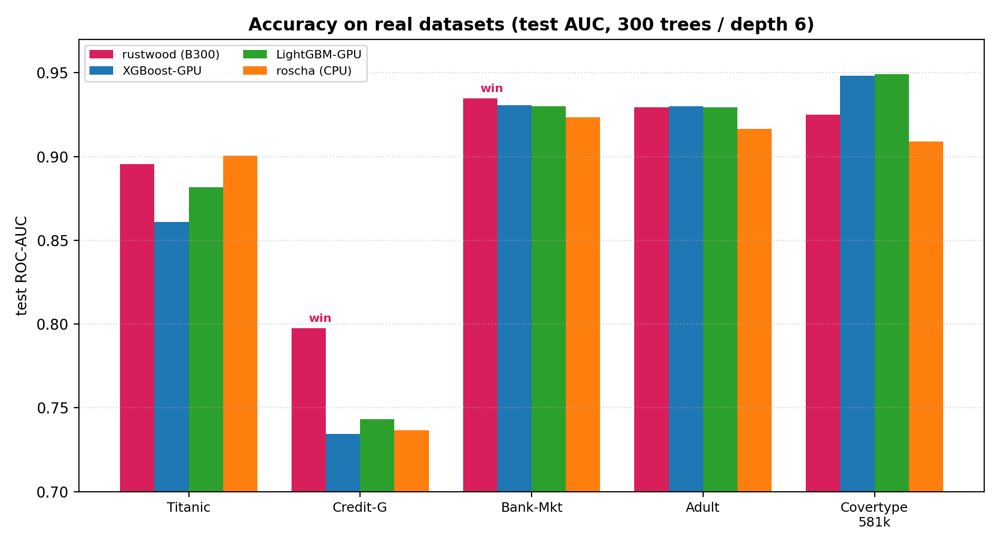
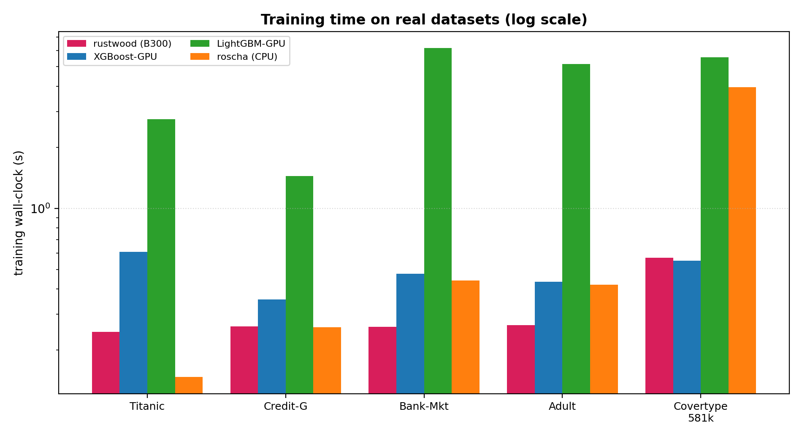
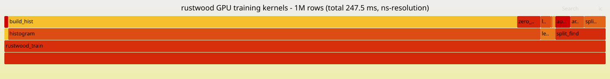

# 🌲 rustwood

**GPU gradient boosting with every kernel written in pure Rust.**

rustwood is a histogram-based, **oblivious-tree** gradient-boosted decision tree library
(XGBoost-style histograms, CatBoost-style symmetric trees) where *all* GPU kernels are
written in **pure Rust** and compiled to PTX by [NVlabs **cuda-oxide**](https://github.com/NVlabs/cuda-oxide) —
no CUDA C, no FFI shims. It targets **NVIDIA Blackwell** (built and benchmarked on a
**B300**, `sm_103`).

> Oblivious trees use one `(feature, threshold)` split per depth, so a depth-`D` tree is
> just `D` splits and `2^D` leaves. That makes split-finding a single argmax per level and
> **inference branchless** — the source of rustwood's order-of-magnitude faster predictions.

---

## Highlights

- ⚡ **Fastest training** of the GPU boosters tested — 1.5–6× faster than XGBoost-GPU and
  5–30× faster than LightGBM-GPU at matched hyperparameters.
- 🚀 **40–800× faster inference** — branchless oblivious scoring, **~0.6 ns/row** peak
  (≈1.7 **billion** rows/s), **289 ns** true single-row latency on the CPU path.
- 🎯 **Competitive-to-winning accuracy on real data** — wins on categorical/financial
  tabular sets (Credit-G, Bank-Marketing); on par on Adult; behind only on big all-numeric
  problems (Covertype), the known oblivious-tree weak spot.
- 🧩 **Fully async on one CUDA stream** — gradients, histograms, split selection, leaf
  values and the model all live on the GPU; the host syncs once at the end.
- 🔬 Rich feature set: target encoding, monotonic constraints, GOSS, feature importance,
  PGBM prediction intervals, 4-bit bin packing, f16/int atomic histograms, and more.

---

## Results

### Real datasets (test AUC, 300 trees / depth 6)

Five real OpenML/sklearn datasets — missing values imputed, categoricals encoded, same
features for every library.




| dataset | features (cat) | **rustwood** | XGBoost-GPU | LightGBM-GPU | baseline |
|---------|:---:|:---:|:---:|:---:|:---:|
| **Bank-Marketing** | 16 (9) | **0.9346 🏆** | 0.9305 | 0.9301 | 0.9235 |
| **Credit-G** | 20 (13) | **0.7974 🏆** | 0.7344 | 0.7432 | 0.7365 |
| Adult | 14 (8) | 0.9294 | 0.9301 | 0.9294 | 0.9165 |
| Titanic | 7 (2) | 0.8956 | 0.8609 | 0.8816 | **0.9005** |
| Covertype (581k) | 54 (0) | 0.9250 | 0.9481 | **0.9492** | 0.9091 |

rustwood is strongest exactly where structured/categorical signal dominates, and trails
only on the large all-numeric problem (where asymmetric leaf-wise trees extract more from
many numeric interactions — the honest oblivious-tree limitation).

### Synthetic scaling


Training is fastest at every size; **inference is 1–2 orders of magnitude faster** end to
end. The iso-accuracy frontier shows rustwood reaching XGBoost-class accuracy in comparable
time and dominating LightGBM/baseline on the accuracy-vs-time plane:


### Where the GPU time goes

Per-kernel flamegraphs (nanosecond resolution, via `--profile-out`). After the async
rewrite + replication + subtraction, the histogram build is the sole hotspot:



---

## How it works

```
features ──quantize(GPU)──▶ u8 bins ─┐
                                     ▼
  ┌─────────────────── per boosting round (all on one stream, no host sync) ───────────────┐
  │ grad/hess ─▶ build histograms ─▶ reduce ─▶ split_gain ─▶ argmax_split ─▶ apply_split    │
  │ (oblivious: same split for every node at a depth)        leaf_hist ─▶ leaf values        │
  └──────────────────────────────────────────────────────────────────────────────────────┘
                                     ▼
                       device-resident model ──▶ branchless inference
```

Performance engineering, in order of impact:

1. **Fully async loop** — split selection (`argmax_split`), leaf values and the chosen
   `(feature, threshold)` are written to device buffers; the host only enqueues kernels.
2. **Histogram privatization by replication** — many global accumulators indexed by block,
   then a parallel reduce, to cut atomic contention (near-optimal on B300).
3. **Histogram subtraction** — build only odd children, derive even = parent − odd (~1.3×).
4. **Prefix-scan split eval**, **GPU argmax**, **preallocated buffers**, **pinned + spin-sync**
   inference.

---

## Build & run

Requires a sibling [`cuda-oxide`](https://github.com/NVlabs/cuda-oxide) checkout
(`../cuda-oxide`), CUDA 13, and the pinned Rust nightly (auto-selected via
`rust-toolchain.toml`). Build the cuda-oxide backend once (`cd ../cuda-oxide && cargo oxide
doctor`), then:

```bash
./build.sh                       # -> target/release/rustwood   (sm_103 / B300)
ARCH=sm_90 ./build.sh            # target a different GPU
./build.sh --features f64-hist   # opt-in f64 histogram accumulation

# generate data and train
python scripts/gen_data.py --out /tmp/d --n 1000000
./target/release/rustwood --data /tmp/d --objective l2 --trees 300 --depth 6 --lr 0.1
```

Benchmark harnesses (need `xgboost`, `lightgbm`, optionally `baseline`):

```bash
python scripts/bench.py        # synthetic scaling vs XGBoost/LightGBM/baseline
python scripts/real_bench.py   # real datasets (Titanic, Adult, Bank, Credit-G, Covertype)
python scripts/latency_bench.py --rustwood-bin target/release/rustwood   # latency sweep
python scripts/viz.py ...       # plots + flamegraphs
```

---

## Features (all off by default; the default path is the fast f32 booster)

| feature | flag | note |
|---------|------|------|
| Categorical target encoding (out-of-fold) | `--categorical 2,5,…` | biggest accuracy lever on categorical data |
| Unique-quantile bins | `--unique-bins 1` | each bin a distinct value range |
| Hashing trick | `--cat-hash-buckets 64` | bound cardinality for huge categoricals |
| Monotonic constraints | `--monotone 1,0,-1,…` | enforce direction per feature |
| Stochastic boosting | `--subsample` / `--colsample` | regularize + speed |
| GOSS | `--goss-top 0.3 --goss-other 0.2` | gradient-based one-side sampling |
| Hessian clamp (exp.) | `--clamp-hessian 0.01` | winsorize hessian tails |
| Feature importance | (always) | gain% + split counts printed |
| PGBM intervals | `--pgbm 1` | per-row predictive σ + coverage |
| Histogram subtraction | `--subtract 1` (default) | ~1.3× faster |
| 4-bit bin packing | `--pack4 1` (`--bins ≤16`) | trims bin-read bandwidth |
| Shared-mem / f16 / int atomic histograms | `--smem-hist` / `--f16-hist` / `--int-hist` | experimental atomic-path variants |
| f64 accumulation | build `--features f64-hist` | precision at extreme N |

Objectives: `--objective l2` (RMSE/MAE/R²) and `--objective logistic` (AUC/logloss/accuracy).

---

## Project layout

```
rustwood/
├── src/
│   ├── gpu_kernels.rs   # all #[kernel] functions (pure Rust → PTX)
│   ├── booster.rs       # async training loop, device-resident model, inference
│   ├── data.rs encoding.rs config.rs metrics.rs main.rs
├── scripts/             # data gen, benchmark harnesses, plotting
├── results/             # generated plots + flamegraphs
└── build.sh             # build against a sibling cuda-oxide checkout
```

---

## Acknowledgements & related work

Built entirely on **NVlabs cuda-oxide** (Rust → PTX). The half-precision atomic it needed
for an experiment (`DeviceAtomicF16` → `atom.add.noftz.f16`) was contributed upstream.
Benchmarked against XGBoost, LightGBM (Apache-2.0 / MIT) and **baseline**; rustwood's feature
set draws on published techniques from those libraries and CatBoost / PGBM papers.

**Honest limitations:** oblivious trees are less expressive per tree than asymmetric
leaf-wise trees, so on large all-numeric problems rustwood trails XGBoost/LightGBM on
accuracy (it's faster, so more rounds partly close the gap). PGBM interval calibration is
conservative. f16/shared-memory atomic histograms are correct but not faster than f32 +
replication on B300 (measured) — kept as flags for other hardware/workloads.
