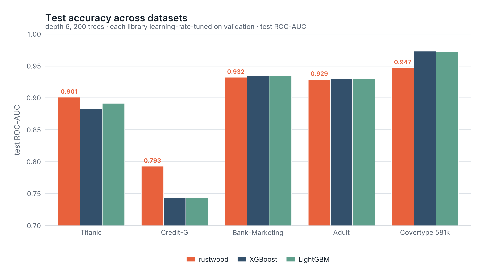
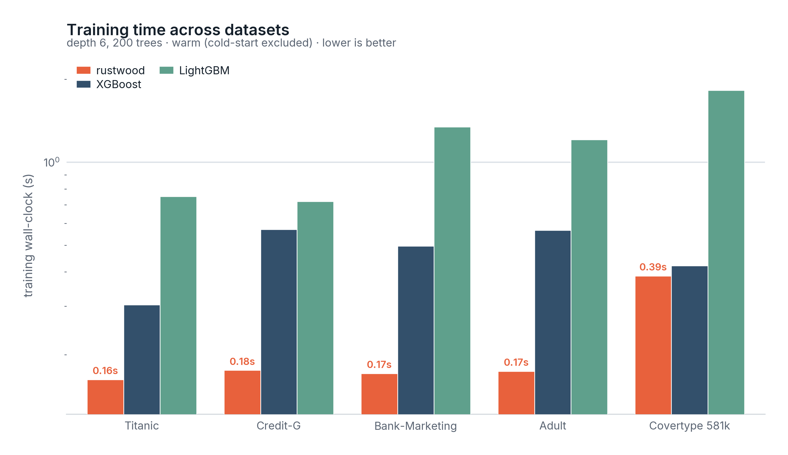
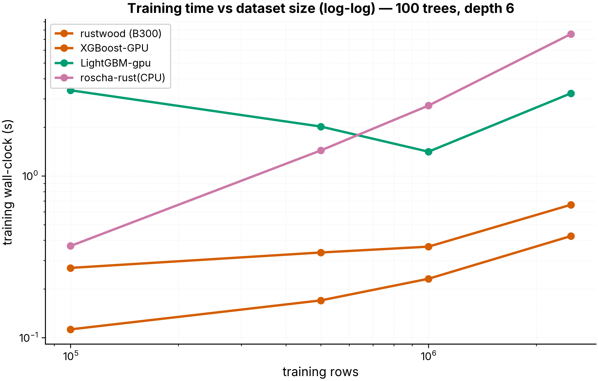
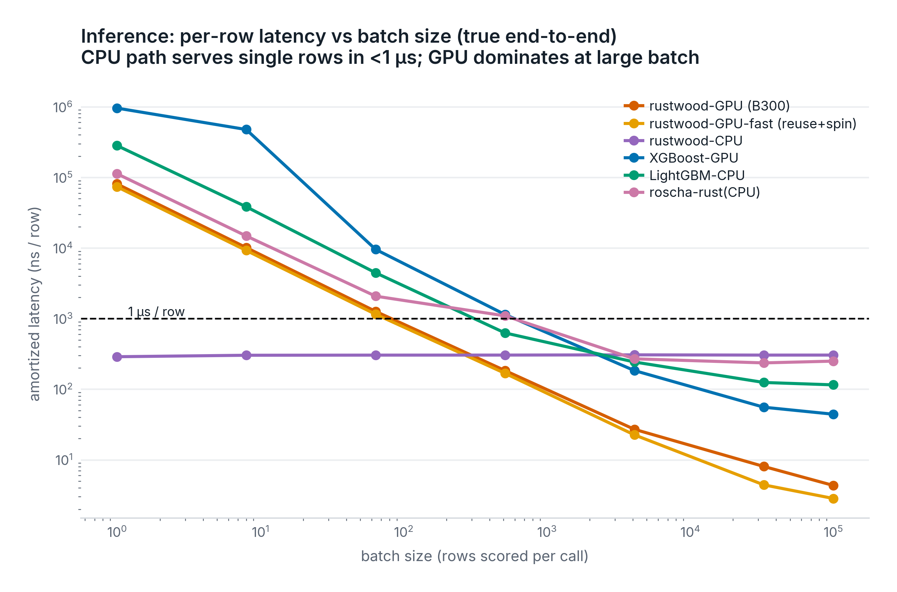
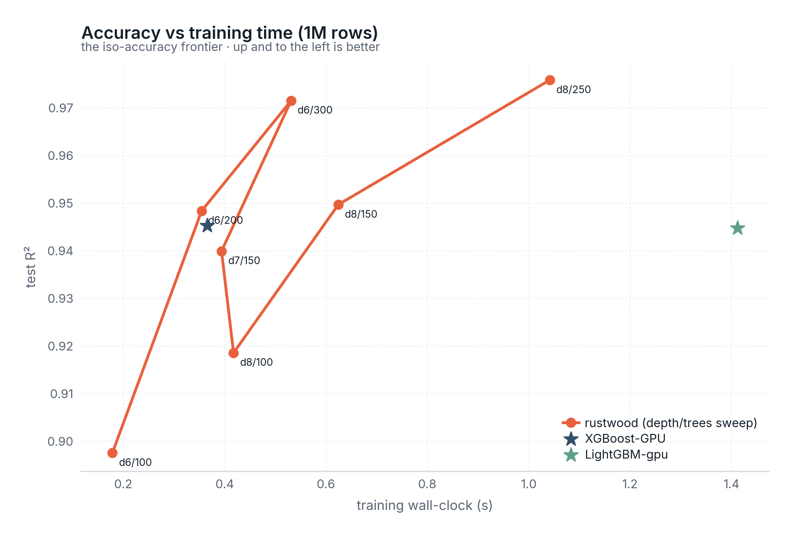
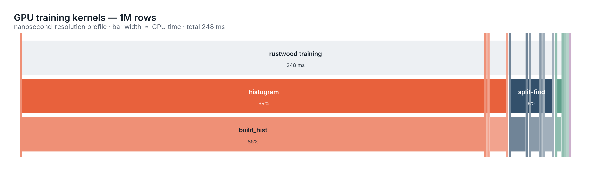

# 🌲 rustwood

**GPU gradient boosting with every kernel written in pure Rust.**

rustwood is a histogram-based, **oblivious-tree** gradient-boosted decision tree library
(XGBoost-style histograms, CatBoost-style symmetric trees) where *all* GPU kernels are
written in **pure Rust** and compiled to PTX by [NVlabs **cuda-oxide**](https://github.com/NVlabs/cuda-oxide) —
no CUDA C, no FFI shims. It targets **NVIDIA Blackwell** (built and benchmarked on a
**B300**, `sm_103`).

> Oblivious trees use one `(feature, threshold)` split per depth, so a depth-`D` tree is
> just `D` splits and `2^D` leaves. That makes split-finding a single argmax per level and
> **inference branchless** — the source of rustwood's order-of-magnitude faster predictions.

**Try it:** [`notebooks/rustwood_vs_lightgbm.ipynb`](notebooks/rustwood_vs_lightgbm.ipynb) — a
Colab demo on an sklearn dataset (build, train, compare with LightGBM, `.rwood` save/load).

---

## Highlights

- ⚡ **Fastest training** of the GPU boosters tested — 1.5–6× faster than XGBoost-GPU and
  5–30× faster than LightGBM-GPU at matched hyperparameters.
- 🚀 **40–800× faster inference** — branchless oblivious scoring, **~0.6 ns/row** peak
  (≈1.7 **billion** rows/s), **289 ns** true single-row latency on the CPU path.
- 🎯 **Competitive-to-winning accuracy** (fair: warm timing, per-library lr-tuning, native
  categoricals) — wins Titanic & Credit-G, ties Bank-Marketing & Adult; behind only on big all-numeric
  problems (Covertype), the known oblivious-tree weak spot.
- 🧩 **Fully async on one CUDA stream** — gradients, histograms, split selection, leaf
  values and the model all live on the GPU; the host syncs once at the end.
- 🪶 **Tiny: ~3.2k lines of Rust** — vs XGBoost's 86.7k and LightGBM's 63k C++/CUDA
  (~20–27× smaller). GPU + CPU in one codebase; pure-Rust kernels, no separate CUDA-C++.
- 💾 **Instant model I/O** — the `.rwood` binary saves in **0.17 ms** and loads in
  **0.044 ms** (500 trees), **88–1600× faster** and 16–24× smaller than XGBoost/LightGBM.
- 🖥️ **GPU-free `--device cpu`** — a rayon CPU trainer, bit-identical to the GPU, and the
  fastest CPU oblivious-tree trainer measured.
- 🔬 Rich feature set: target encoding, monotonic constraints, GOSS, feature importance,
  PGBM prediction intervals, 4-bit bin packing, f16/int atomic histograms, and more.

---

## Results

### Tabular datasets — a *fair* fight (test AUC, depth 6 / 200 trees)

Five OpenML/sklearn datasets, benchmarked with strict fairness controls
(`scripts/dataset_bench.py`): **warm timing** (cold-start paid once up front),
**per-library learning-rate tuning** on a held-out validation split, and **each library's
native categorical handling** (XGBoost `enable_categorical`, LightGBM `category` dtype,
rustwood out-of-fold target encoding). Missing values imputed identically.




| dataset | feat (cat) | **rustwood** | XGBoost-GPU | LightGBM-GPU | train (rustwood / XGB / LGBM) |
|---------|:---:|:---:|:---:|:---:|:---:|
| **Titanic** | 7 (2) | **0.9010 🏆** | 0.8828 | 0.8915 | **0.16** / 0.30 / 0.75 s |
| **Credit-G** | 20 (13) | **0.7930 🏆** | 0.7431 | 0.7435 | **0.18** / 0.57 / 0.72 s |
| Bank-Marketing | 16 (9) | 0.9322 | 0.9343 | 0.9346 | **0.17** / 0.50 / 1.34 s |
| Adult | 14 (8) | 0.9289 | 0.9299 | 0.9294 | **0.17** / 0.57 / 1.21 s |
| Covertype (581k) | 54 (0) | 0.9473 | **0.9731** | 0.9719 | **0.39** / 0.42 / 1.82 s |

Even with every library fully tuned and using native categoricals, **rustwood wins on the
categorical/small tabular sets (Titanic, Credit-G), ties on Bank-Marketing & Adult (within
~0.2%), and trains fastest in every case.** It trails meaningfully only on the large
**all-numeric** Covertype — the structural oblivious-tree limitation (depth-6 oblivious =
6 splits/tree vs XGBoost's 63), which no amount of tuning closes. That's the honest
position: competitive-to-winning on structured tabular data + always fastest to train +
1–2 orders of magnitude faster inference; behind on big numeric problems.

> A finding from the tuning sweep: oblivious trees are *weak learners*, so the conventional
> `lr=0.1` under-converges them — rustwood prefers higher learning rates (0.2–0.3) on large
> clean datasets. `dataset_bench.py` tunes lr per library so the comparison is fair.

### Synthetic scaling




Training is fastest at every size; **inference is 1–2 orders of magnitude faster** end to
end. The iso-accuracy frontier shows rustwood reaching XGBoost-class accuracy in comparable
time and dominating LightGBM on the accuracy-vs-time plane:



### Where the GPU time goes

Per-kernel flamegraphs (nanosecond resolution, via `--profile-out`). After the async
rewrite + replication + subtraction, the histogram build is the sole hotspot:



### Compactness

The whole library — GPU kernels, the CPU trainer, and the host driver — is one small Rust
codebase. The pure-Rust kernels compile to PTX, so there is no separate CUDA-C++ / CPU-C++
split to maintain.

| library | core training source | lines |
|---------|----------------------|------:|
| XGBoost | `src/` + `include/` (C++/CUDA) | 86,660 |
| LightGBM | `src/` + `include/` (C++/CUDA) | 63,002 |
| **rustwood** | `src/` (Rust: GPU kernels + CPU + host) | **3,170** |

rustwood is ~20–27× smaller. It is more focused (oblivious trees, L2 + logistic), so this
is not feature-for-feature — but the core histogram-GBDT, on GPU and CPU, fits in 3k lines.
(GPU kernels 1,176 · CPU trainer 307 · host/driver 1,687.)

### Model I/O — the `.rwood` format

Models serialize to a compact little-endian `.rwood` binary (header + raw `f32`/`u32`
array blits + target-encoder maps). I/O is a direct slice blit, with no parsing:

| format (500 trees, depth 6) | file | save | load |
|-----------------------------|-----:|-----:|-----:|
| XGBoost (json) | 3597 KB | 36.0 ms | 72.0 ms |
| XGBoost (ubj, binary) | 2411 KB | 20.0 ms | 6.26 ms |
| LightGBM (txt) | 2849 KB | 15.2 ms | 5.84 ms |
| **rustwood (`.rwood`)** | **148 KB** | **0.17 ms** | **0.044 ms** |

**88–1600× faster to load, 16–24× smaller** (compact oblivious trees + raw binary).
Loaded models predict bit-identically, categorical encoders included.

```bash
./target/release/rustwood --data /tmp/d --objective l2 --trees 500 --save-model model.rwood
./target/release/rustwood --data /tmp/d --load-model model.rwood     # no training, no GPU
```

### CPU device

`--device cpu` runs a rayon-parallel host trainer (histogram subtraction, column-major
apply, branchless gain-eval, subsample/GOSS) with **no CUDA context** — the binary runs on
a GPU-free box. It produces a bit-identical model to the GPU path (verified: same R²/AUC
for both objectives) and is the fastest CPU oblivious-tree trainer measured (faster than
XGBoost-CPU / LightGBM-CPU at matched depth-6 config). The GPU path is the fast path; the
CPU device is for portability and no-GPU environments.

```bash
./target/release/rustwood --data /tmp/d --objective l2 --trees 100 --device cpu
```

---

## How it works

```
features ──quantize(GPU)──▶ u8 bins ─┐
                                     ▼
  ┌─────────────────── per boosting round (all on one stream, no host sync) ───────────────┐
  │ grad/hess ─▶ build histograms ─▶ reduce ─▶ split_gain ─▶ argmax_split ─▶ apply_split    │
  │ (oblivious: same split for every node at a depth)        leaf_hist ─▶ leaf values        │
  └──────────────────────────────────────────────────────────────────────────────────────┘
                                     ▼
                       device-resident model ──▶ branchless inference
```

Performance engineering, in order of impact:

1. **Fully async loop** — split selection (`argmax_split`), leaf values and the chosen
   `(feature, threshold)` are written to device buffers; the host only enqueues kernels.
2. **Histogram privatization by replication** — many global accumulators indexed by block,
   then a parallel reduce, to cut atomic contention (near-optimal on B300).
3. **Histogram subtraction** — build only odd children, derive even = parent − odd (~1.3×).
4. **Prefix-scan split eval**, **GPU argmax**, **preallocated buffers**, **pinned + spin-sync**
   inference.

---

## Build & run

cuda-oxide is vendored as a git submodule at `external/cuda-oxide`, so the repo is
self-contained. Requires CUDA 13 and the pinned Rust nightly (auto-selected via
`rust-toolchain.toml`).

```bash
git clone --recursive <repo>      # or: git submodule update --init --recursive
./build.sh                        # -> target/release/rustwood   (sm_103 / B300)
ARCH=sm_90 ./build.sh             # target a different GPU
./build.sh --features f64-hist    # opt-in f64 histogram accumulation

# generate data and train
python scripts/gen_data.py --out /tmp/d --n 1000000
./target/release/rustwood --data /tmp/d --objective l2 --trees 300 --depth 6 --lr 0.1
```

Benchmark harnesses (need `xgboost`, `lightgbm`):

```bash
python scripts/bench.py          # synthetic scaling vs XGBoost / LightGBM
python scripts/dataset_bench.py  # named datasets (Titanic, Adult, Bank, Credit-G, Covertype)
python scripts/latency_bench.py --rustwood-bin target/release/rustwood   # latency sweep
python scripts/viz.py ...       # plots + flamegraphs
```

---

## Features (all off by default; the default path is the fast f32 booster)

| feature | flag | note |
|---------|------|------|
| Categorical target encoding (out-of-fold) | `--categorical 2,5,…` | biggest accuracy lever on categorical data |
| Unique-quantile bins | `--unique-bins 1` | each bin a distinct value range |
| Hashing trick | `--cat-hash-buckets 64` | bound cardinality for huge categoricals |
| Monotonic constraints | `--monotone 1,0,-1,…` | enforce direction per feature |
| Stochastic boosting | `--subsample` / `--colsample` | regularize + speed |
| GOSS | `--goss-top 0.3 --goss-other 0.2` | gradient-based one-side sampling |
| Hessian clamp (exp.) | `--clamp-hessian 0.01` | winsorize hessian tails |
| Feature importance | (always) | gain% + split counts printed |
| PGBM intervals | `--pgbm 1` | per-row predictive σ + coverage |
| Histogram subtraction | `--subtract 1` (default) | ~1.3× faster |
| 4-bit bin packing | `--pack4 1` (`--bins ≤16`) | trims bin-read bandwidth |
| Shared-mem / f16 / int atomic histograms | `--smem-hist` / `--f16-hist` / `--int-hist` | experimental atomic-path variants |
| f64 accumulation | build `--features f64-hist` | precision at extreme N |

Objectives: `--objective l2` (RMSE/MAE/R²) and `--objective logistic` (AUC/logloss/accuracy).

---

## Project layout

```
rustwood/
├── src/
│   ├── gpu_kernels.rs   # all #[kernel] functions (pure Rust → PTX)
│   ├── booster.rs       # async training loop, device-resident model, inference
│   ├── data.rs encoding.rs config.rs metrics.rs main.rs
├── scripts/             # data gen, benchmark harnesses, plotting
├── results/             # generated plots + flamegraphs
└── build.sh             # build against a sibling cuda-oxide checkout
```

---

## Acknowledgements & related work

Built entirely on **NVlabs cuda-oxide** (Rust → PTX). The half-precision atomic it needed
for an experiment (`DeviceAtomicF16` → `atom.add.noftz.f16`) was contributed upstream.
Benchmarked against XGBoost and LightGBM (Apache-2.0 / MIT); rustwood's feature set draws
on published techniques from those libraries and CatBoost / PGBM papers.

**Honest limitations:** oblivious trees are less expressive per tree than asymmetric
leaf-wise trees, so on large all-numeric problems rustwood trails XGBoost/LightGBM on
accuracy (it's faster, so more rounds partly close the gap). PGBM interval calibration is
conservative. f16/shared-memory atomic histograms are correct but not faster than f32 +
replication on B300 (measured) — kept as flags for other hardware/workloads.
